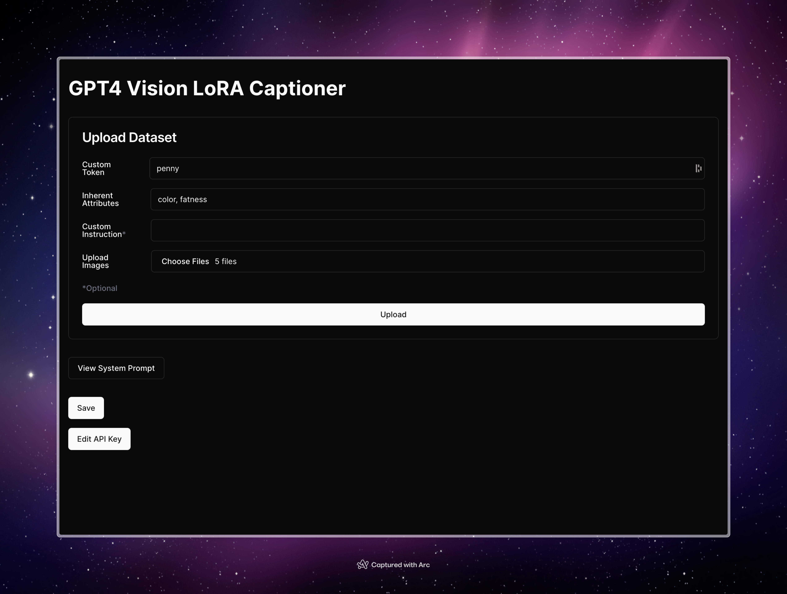

# GPT-4 Vision Image Captioner

A powerful GPT-4 API Wrapper for captioning images, with direct exporting to standard Stable Diffusion LoRA training format.



## Features

- Upload an unlimited number of images for captioning
- Customize captions with a user-defined token
- Generate detailed captions using the GPT-4 Vision API
- Edit and refine generated captions
- Generate additional unique captions based on the generated captions
- Export images and captions in a format suitable for Stable Diffusion LoRA training
- User-friendly interface built with Next.js, React, and Tailwind CSS
- Secure API key management using local storage

## It uses

- Node.js (version 14 or higher)
- Bun (or pnpm, but please don't use npm)
- OpenAI API key with access to the GPT-4 API

## Installation

1. Clone the repository:

```bash
git clone https://github.com/markuryy/gpt4v-image-captioner.git
```

2. Navigate to the project folder:

```bash
cd gpt4v-image-captioner
```

3. Install dependencies using Bun:

```bash
bun install
```

4. Run the development server:

```bash
bun run dev
```

5. Open your browser and navigate to `http://localhost:3000` to access the application.

## Usage

1. Enter your OpenAI API key with access to the GPT-4 API in the provided dialog when prompted. If you don't have an API key, you can obtain one from the [OpenAI website](https://platform.openai.com/account/api-keys). Please note that the API key is stored in your browser's local storage for persistence between sessions.

2. Upload the images you want to caption. There is no limit to the number of images you can upload.

3. Customize the captions by entering a custom token, custom instruction, and inherent attributes to avoid.

4. Click the "Upload" button to generate captions for the uploaded images.

5. Review and edit the generated captions as needed.

6. View the additional unique captions generated based on the original captions.

7. Click the "Save" button to export the images and captions as a ZIP file in a format suitable for Stable Diffusion LoRA training.

## Live Demo

You can try out the application live on Vercel:

[https://gpt4v-image-captioner.vercel.app/](https://gpt4v-image-captioner.vercel.app/)

Please note that you will need to provide your own OpenAI API key with access to the GPT-4 API to use the application.

## Contributing

Feel free to submit issues or pull requests if you find any bugs or want to contribute to the project. We appreciate your help!

## License

This project is open-source and available under the [MIT License](LICENSE).
